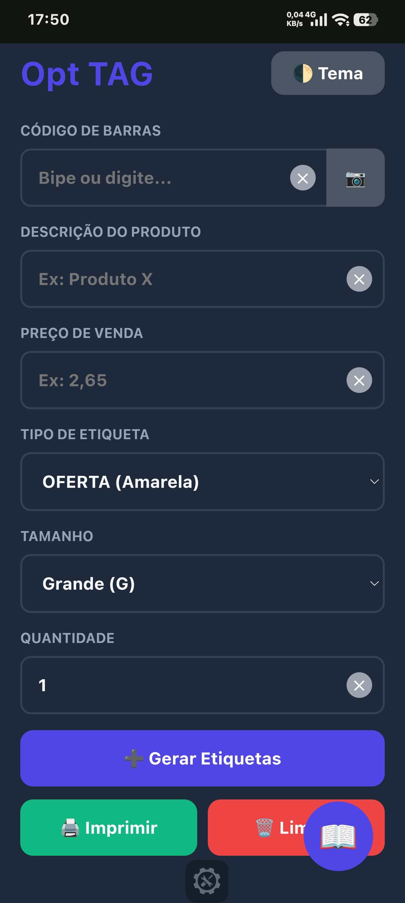
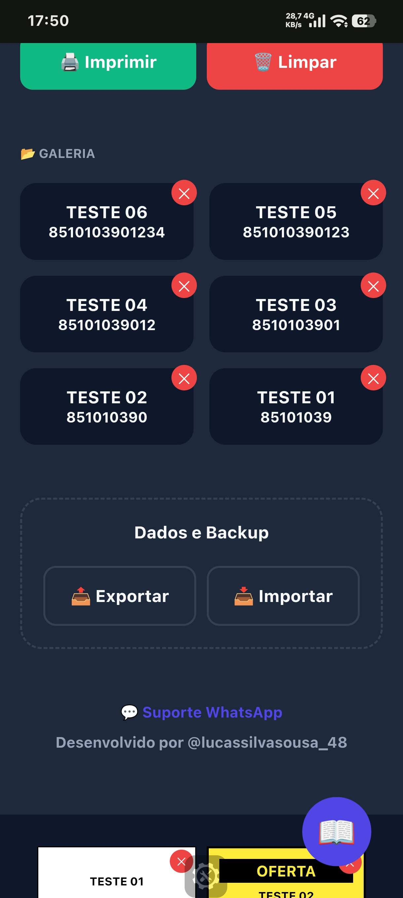
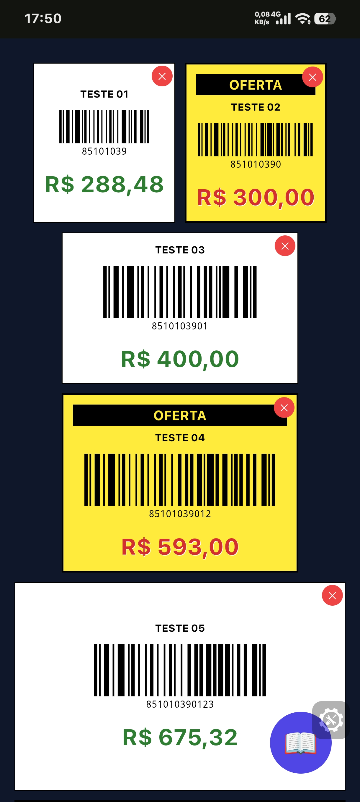
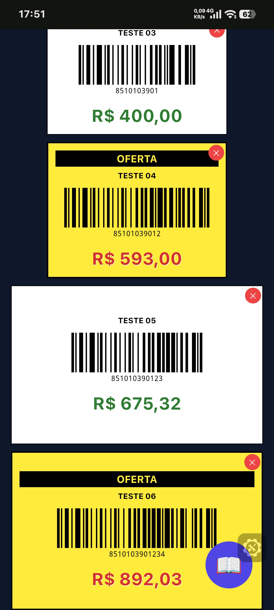
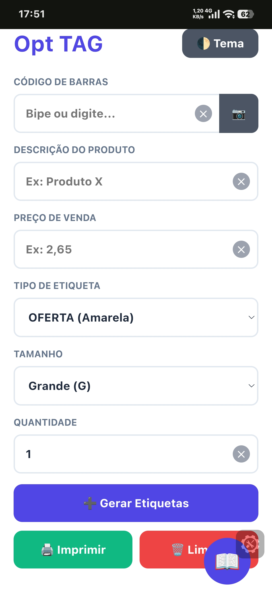
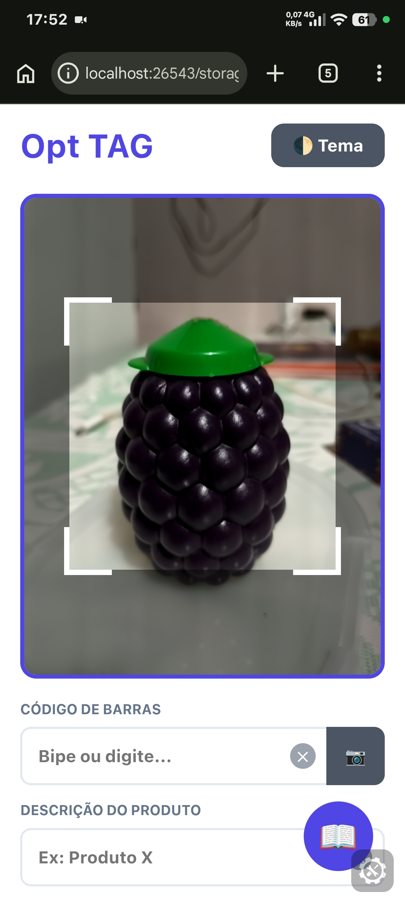
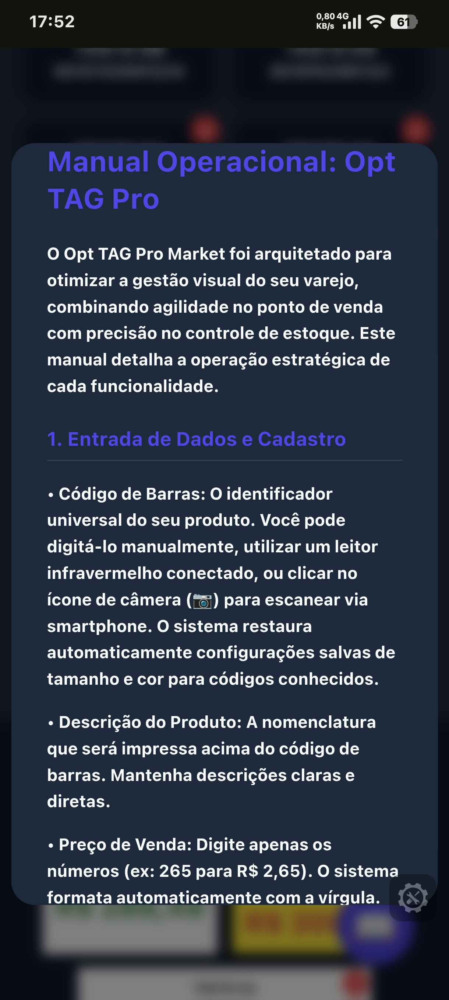
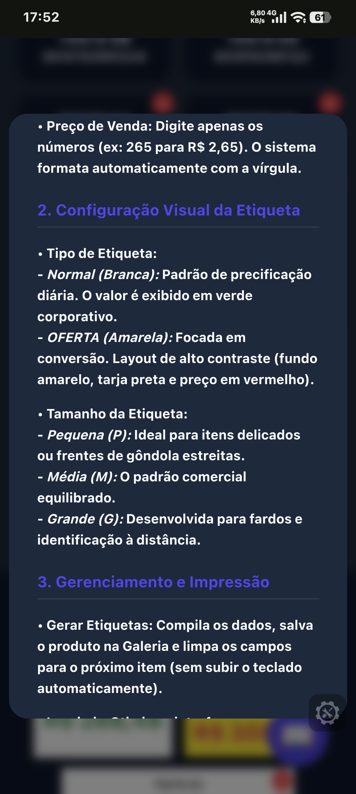
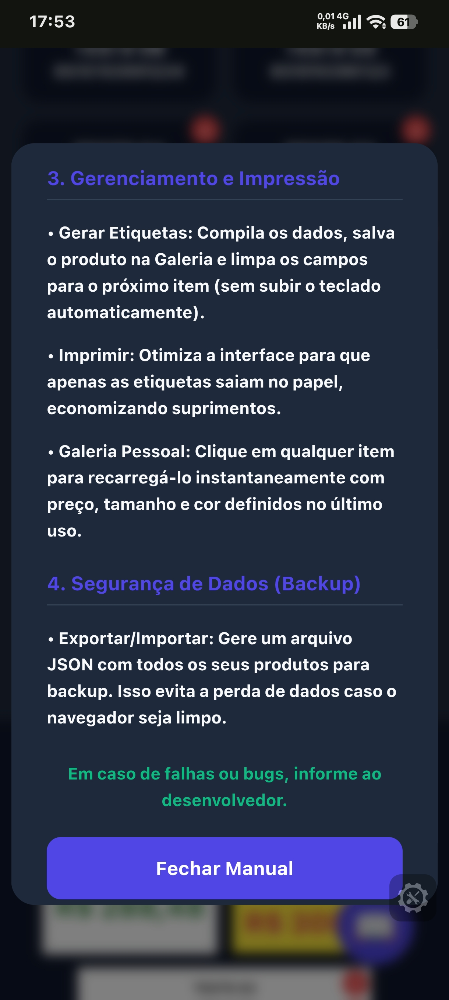
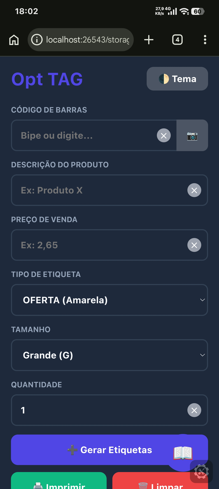

   
  
   
   
  
   

# 🏷️ Opt TAG Pro (Mobile Edition)

  

  
  
  

---

## 🔗 Link de Acesso Online
Você pode testar o gerador de etiquetas em tempo real clicando no link abaixo:
👉 **[Clique aqui para abrir o Opt TAG Pro](https://lucas-silva28.github.io/HTML5-e-CSS3/)**

---

## 📸 Demonstração do Sistema

Abaixo, as etapas de operação da interface para geração de etiquetas:

  <b>📱 Tela inicial para entrada de dados e preços</b> 
  

  <b>📷 Scanner de código de barras via câmera</b> 
  

  <b>🏷️ Seleção de tamanhos de etiquetas (P, M e G)</b> 
  

  <b>🌙 Interface Opt TAG em Modo Escuro</b> 
  

  <b>🔥 Modo Oferta: Etiquetas destacadas em amarelo</b> 
  

  <b>📂 Galeria de produtos salvos para geração rápida</b> 
  

  <b>🖨️ Pré-visualização das etiquetas para impressão</b> 
  

  <b>⚙️ Ajustes de contraste para leitura em tela</b> 
  

  <b>✅ Etiquetas geradas prontas para uso</b> 
  

---

## 🚀 Visão Geral do Projeto

O **Opt TAG Pro** é uma ferramenta profissional desenvolvida para lojistas que precisam de agilidade na precificação de produtos. O foco principal é permitir que, através de um celular, o usuário possa escanear um item, definir o preço e gerar uma etiqueta com código de barras padronizado em segundos.

### 🎯 Objetivos Principais
- **Agilidade na Precificação:** Gerar etiquetas individuais ou em massa sem depender de softwares pesados.
- **Scanner Mobile:** Utilização da câmera do smartphone para identificar códigos de barras existentes.
- **Customização de Ofertas:** Diferenciação visual imediata entre preços normais e itens em promoção.
- **Independência de Rede:** Funciona offline através de armazenamento local (LocalStorage).

---

## ⚙️ Especificações Técnicas

O sistema utiliza tecnologias modernas de front-end para garantir leveza e alta precisão nos códigos gerados.

- **Linguagens:** HTML5, CSS3 (Custom Properties), JavaScript (ES6+).
- **Persistência de Dados:** LocalStorage API para a galeria de produtos.
- **Bibliotecas Externas:**
  - [JsBarcode](https://github.com/lindell/JsBarcode): Geração de códigos de barras de alta precisão.
  - [Html5-Qrcode](https://github.com/mebjas/html5-qrcode): Processamento de scanner via câmera.

---

## 📱 Guia de Versionamento e Fluxo Mobile

Como o projeto é mantido 100% via dispositivos móveis, a estrutura de versionamento segue um fluxo rigoroso:

1. **Editor de Código:** Utilização do app **Acode**.
2. **Controle de Versão:** Uso de commits granulares para cada melhoria na renderização das etiquetas.
3. **Histórico:** Evolução documentada desde a lógica de scanner até o ajuste de layouts de impressão.

---

## 📖 Manual de Operação (Passo a Passo)

### 1. Entrada de Dados
Insira o código de barras (digitando ou usando a câmera), o nome do produto e o preço.

### 2. Escolha do Layout
- **Tamanhos:** Escolha entre P, M ou G dependendo do tamanho da sua prateleira ou produto.
- **Tipo:** Selecione "Normal" ou "OFERTA" para mudar a cor da etiqueta automaticamente.

### 3. Impressão e Uso
As etiquetas aparecem no final da página. Você pode usar a função de imprimir do navegador ou tirar um print para leitura direta em coletores de dados.

---

## 💾 Segurança e Galeria
Os produtos que você cadastra ficam salvos na sua **Galeria**. Isso permite que você gere a etiqueta novamente no futuro com apenas um clique, sem precisar digitar tudo de novo.

---

## ​⚖️ Licença e Contribuição ##

​Este projeto está sob a Licença MIT. Isso significa que você é livre para usar, copiar, modificar e até distribuir o software, desde que mantenha os créditos originais da KODA Sistemas.

##​ 🤝 Apoie este Projeto ##

​O Opt TAG Pro é um projeto de código aberto desenvolvido com foco em ajudar pequenos e médios empreendedores. Se este sistema foi útil para o seu negócio, você pode apoiar de duas formas:
​
## Siga o desenvolvedor: ##

Acompanhe as atualizações e novos lançamentos no meu Instagram ## @lucassilvasousa_48. ##
​Dê uma Estrela: Se você está no GitHub, clique não #⭐# no topo da página. Isso ajuda o projeto a ganhar visibilidade e chegar a mais lojistas!

#⭐#

---
**Desenvolvido com ☕ e Lógica por Lucas Silva | KODA Sistemas** *Araguaína, Tocantins, Brasil*

-_-_-_-_-_-_
