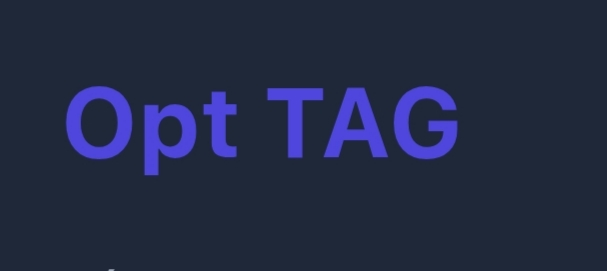

# 🏷️ Opt TAG - Pro Market

> Sistema inteligente para gestão e impressão de etiquetas de gôndola.

**🔗 [CLIQUE AQUI PARA ACESSAR O SISTEMA AO VIVO](https://lucas-silva28.github.io/HTML5-e-CSS3/)**

---

## 🚀 O que o Opt TAG faz?

O **Opt TAG** foi desenvolvido para otimizar a rotina de precificação no varejo. Diferente de geradores comuns, ele possui memória local e foco em agilidade mobile.

* **⚡ Fluxo Ágil:** Ao gerar uma etiqueta, os campos limpam automaticamente sem subir o teclado, permitindo biper vários produtos em sequência sem interrupções.
* **🧠 Banco de Dados Local:** O sistema memoriza o nome, preço e tamanho de cada código de barras. Se você biper o mesmo produto amanhã, os dados aparecem sozinhos!
* **📸 Scanner Integrado:** Use a câmera do celular para ler códigos diretamente no navegador.
* **🎨 Etiquetas de Oferta:** Alternância rápida para o modo promocional (Amarelo/Preto/Vermelho).
* **💾 Backup Seguro:** Função de exportar e importar dados em JSON.

## 📸 Demonstração Visual do Sistema

| Logo do Projeto | Interface Inicial |
|---|---|
|  |  |
| **Gerenciamento de Galeria** | **Tamanhos e Cores** |
|  |  |
| **Alteração de Temas (Dark/Light)** | **Scanner Ativo** |
|  |  |
| **Tutorial Explicativo 01** | **Tutorial Explicativo 02** |
|  |  |
| **Tutorial Explicativo 03** | **Início do Sistema (Mobile)** |
|  |  |

> *Abaixo, a visualização completa da aplicação rodando em dispositivo móvel:*

  

*O sistema adapta-se perfeitamente a diferentes tamanhos de tela e preferências de uso.*

>## 🛠️ Detalhes Técnicos e Diferenciais

Este projeto foi construído focando na **Eficiência Operacional** do lojista. Os principais destaques técnicos são:

* **Persistência de Dados:** Uso de `localStorage` para manter o banco de dados de produtos disponível mesmo sem internet.
* **Performance UX:** Manipulação do DOM para garantir que a interface não trave durante a geração de múltiplas etiquetas.
* **Responsividade:** CSS Grid e Flexbox garantindo que o painel de controle funcione de tablets a smartphones antigos.
* **Segurança de Backup:** Algoritmo de exportação para arquivos `.json` permitindo a migração de dados entre dispositivos.

## 📜 Licença

Este projeto está licenciado sob a **Licença MIT**. Isso significa que você pode:
* Usar o sistema para fins comerciais ou pessoais.
* Modificar o código conforme sua necessidade.
* Distribuir o código.
* *Apenas pedimos que mantenha os créditos originais ao desenvolvedor.*

---

>  
> 
## 🛠️ Tecnologias
* HTML5 / CSS3 (Design Responsivo & Dark Mode)
* JavaScript Vanilla (Lógica de Persistência e UI)
* JsBarcode & Html5-QRCode

---
## 👨‍💻 Desenvolvedor
**Lucas Silva**
* 📷 Instagram: [@lucassilvasousa_48](https://www.instagram.com/lucassilvasousa_48)
* 💬 WhatsApp: [Numero whatsapp](https://wa.me/número whatsapp)
* 

## 🤝 Contribuições

Sugestões e melhorias são sempre bem-vindas!
1. Faça um **Fork** do projeto.
2. Crie uma **Branch** para sua modificação (`git checkout -b feature/NovaFuncionalidade`).
3. Faça o **Commit** das suas alterações.
4. Abra um **Pull Request**.
